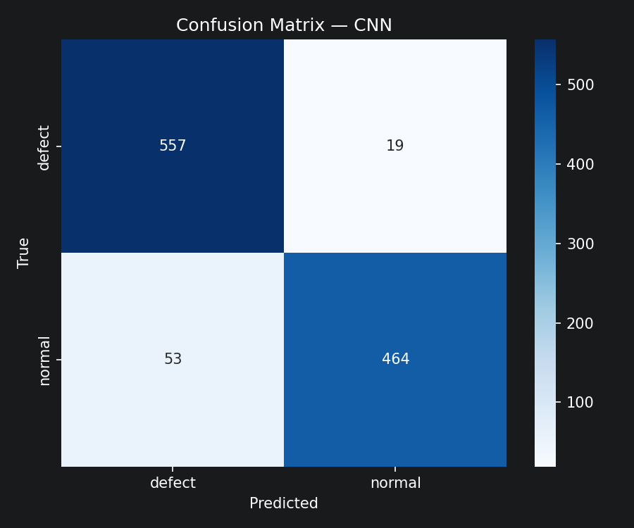

# Metal Surface Defect Detection

A CNN-based binary image classifier that detects manufacturing defects on metal surfaces (`defect` vs `normal`), served as a REST API with FastAPI and packaged with Docker.

**93.4% test accuracy** on 1,093 held-out images · custom PyTorch CNN with ~423K parameters · full pipeline from raw data to deployed API.

> 🔗 **Live demo:** _coming soon on Hugging Face Spaces_
> 📸 _demo GIF placeholder_

## Results

| Metric (test set, n=1093) | Score |
|---------------------------|-------|
| Accuracy                  | 93.4% |
| Precision (weighted)      | 93.6% |
| Recall (weighted)         | 93.4% |
| F1 (weighted)             | 93.4% |
| Recall on `defect` class  | 96.7% |

High defect recall matters most in quality control: missing a defective part is more costly than a false alarm.



Full metrics: [test_metrics.json](results/metrics/test_metrics.json) · training curves: [training_history.json](results/metrics/training_history.json)

## How it works

- **Data:** 7,284 JPEG images (300×300) with `defect`/`normal` labels; conflicting duplicate labels dropped during preparation; stratified 70/15/15 train/val/test split.
- **Model:** custom CNN — 4 conv blocks (32→64→128→256 channels, BatchNorm + ReLU + MaxPool), global average pooling, 2-layer classifier head with dropout ([src/model.py](src/model.py)).
- **Training:** Adam + ReduceLROnPlateau, class-weighted cross-entropy, augmentation (flips, rotation, color jitter), best-checkpoint saving with resume support ([src/trainer.py](src/trainer.py)).
- **Serving:** FastAPI endpoint loads the checkpoint once at startup and returns class + confidence ([main.py](main.py)).

## Quick start

```bash
git clone <repo-url> && cd CNN
python -m venv .venv
.venv\Scripts\activate          # Linux/macOS: source .venv/bin/activate
pip install torch torchvision   # GPU: see https://pytorch.org/get-started/locally/
pip install -r requirements.txt
```

A trained checkpoint ships with the repo (`results/models/cnn_best.pth`), so inference works out of the box — no dataset or training needed.

### REST API

```bash
pip install -r requirements-api.txt
uvicorn main:app --reload
```

```bash
curl -X POST http://127.0.0.1:8000/predict -F "file=@some_image.jpeg"
```

```json
{
  "class": "defect",
  "confidence": 0.9252,
  "probabilities": { "defect": 0.9252, "normal": 0.0748 }
}
```

Interactive Swagger docs at `http://127.0.0.1:8000/docs`.

### Streamlit demo UI

```bash
python -m streamlit run app/app.py
```

Upload an image and see the prediction, confidence and feature-map visualizations at `http://localhost:8501`.

### Docker

```bash
docker build -t defect-api .
docker run -p 7860:7860 defect-api
```

The image installs CPU-only PyTorch and serves the API on port 7860 (Hugging Face Spaces convention).

## Training from scratch

Place `data.zip` in `data/`, then:

```bash
python scripts/unpack_data.py      # extract images + labels
python scripts/prepare_data.py     # clean labels, create splits
python scripts/train.py            # train CNN (--resume to continue)
python scripts/evaluate.py         # test-set metrics + confusion matrix
```

Optional: `scripts/run_tuning.py` (batch-size search), `scripts/train_baseline.py` (EfficientNet-B0 transfer-learning baseline). All hyperparameters live in [config/settings.yaml](config/settings.yaml).

## Deploy to Hugging Face Spaces

1. Create a new Space → SDK: **Docker**.
2. Add this to the top of the Space's `README.md`:
   ```yaml
   ---
   title: Metal Defect Detection API
   sdk: docker
   app_port: 7860
   ---
   ```
3. Push this repo to the Space:
   ```bash
   git remote add hf https://huggingface.co/spaces/<username>/<space-name>
   git push hf main
   ```

The free CPU tier is sufficient — the model is small (~1.7 MB of weights).

## Project structure

```
├── main.py              # FastAPI inference service
├── Dockerfile           # container for deployment (port 7860)
├── config/settings.yaml # all paths & hyperparameters
├── src/                 # model, data pipeline, trainer, evaluation, tuning
├── scripts/             # CLI entry points (train / evaluate / predict / app)
├── app/                 # Streamlit demo UI
├── notebooks/           # exploratory report notebook
└── results/             # trained model, metrics, plots, feature maps
```
